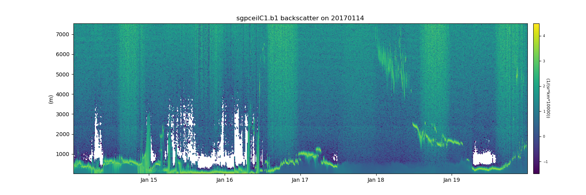

.. Packaging Scientific Python documentation master file, created by
   sphinx-quickstart on Thu Jun 28 12:35:56 2018.
   You can adapt this file completely to your liking, but it should at least
   contain the root `toctree` directive.

Atmospheric data Community Toolkit Documentation
================================================

.. toctree::
   :maxdepth: 4
   :hidden:
   :caption: Documentation

   installation
   CREATING_ENVIRONMENTS.rst
   CONTRIBUTING.rst
   usage
   source/auto_examples/index.rst
   release-history
   API/index.rst

.. toctree::
   :maxdepth: 1
   :hidden:
   :caption: Downloads

   Anaconda Cloud <https://anaconda.org/conda-forge/act-atmos/files>
   GitHub Repository <https://github.com/ARM-DOE/ACT>
   Zip File of Repository <https://github.com/ARM-DOE/ACT/archive/master.zip>

.. toctree::
   :maxdepth: 1
   :hidden:
   :caption: Getting Help

   GitHub Issue Tracker <https://github.com/ARM-DOE/ACT/issues>

Atmospheric Community Toolkit (ACT)
===================================

The Atmospheric Community Toolkit (ACT) is a Python toolkit for working with
atmospheric time-series datasets of varying dimensions. The toolkit is meant
to have functions for every part of the scientific process; discovery, IO,
quality control, corrections, retrievals, visualization, and analysis. Initial
efforts were heavily focused on the static visualization aspect of the process,
but future efforts will look to build up the other areas of interest include
discovery, corrections, retirevals, and interactive plots.

* Free software: 3-clause BSD license

|ceil|

Dependencies
============

* `NumPy <https://www.numpy.org/>`_
* `SciPy <https://www.scipy.org/>`_
* `matplotlib <https://matplotlib.org/>`_
* `xarray <https://xarray.pydata.org/en/stable/>`_
* `astral <https://astral.readthedocs.io/en/latest/>`_
* `pandas <https://pandas.pydata.org/>`_
* `dask <https://dask.org/>`_
* `Pint <https://pint.readthedocs.io/en/0.9/>`_
* `Cartopy <https://scitools.org.uk/cartopy/docs/latest/>`_
* `Boto3 <https://aws.amazon.com/sdk-for-python/>`_
* `PyProj <https://pyproj4.github.io/pyproj/stable/>`_
* `Requests <https://2.python-requests.org/en/master/>`_

Contributing
============

ACT is an open source, community software project. Contributions to the
package are welcomed from all users.

The latest source code can be obtained with the command::

    git clone https://github.com/ARM-DOE/ACT.git

If you are planning on making changes that you would like included in ACT,
forking the repository is highly recommended.

We welcome contributions for all uses of ACT, provided the code can be
distributed under the BSD 3-clause license. For more on
contributing, see the `contributor's guide. <https://arm-doe.github.io/ACT/CONTRIBUTING.html>`_

Testing
=======

After installation, you can launch the test suite from outside the
source directory (you will need to have pytest installed)::

   $ pytest --pyargs act

In-place installs can be tested using the `pytest` command from within
the source directory.
