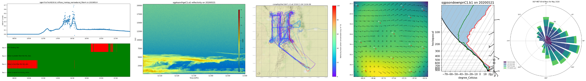

================================================
Atmospheric data Community Toolkit Documentation
================================================

.. toctree::
   :maxdepth: 2
   :hidden:
   :caption: Version 2 Release Guide

   userguide/GUIDE_V2.rst

.. toctree::
   :maxdepth: 2
   :hidden:
   :caption: User Guide

   userguide/index.rst

.. toctree::
   :maxdepth: 2
   :hidden:
   :caption: Reference Guide

   API/index.rst

.. toctree::
   :maxdepth: 2
   :hidden:
   :caption: Example Gallery

   source/auto_examples/index.rst

.. toctree::
   :maxdepth: 1
   :hidden:
   :caption: Blog

   blog.md

.. toctree::
   :maxdepth: 1
   :hidden:
   :caption: Getting Help

   GitHub Issue Tracker <https://github.com/ARM-DOE/ACT/issues>

Atmospheric Community Toolkit (ACT)
===================================
The Atmospheric data Community Toolkit (ACT) is an open source Python toolkit for working with atmospheric time-series datasets of varying dimensions.  The toolkit is meant to have functions for every part of the scientific process; discovery, IO, quality control, corrections, retrievals, visualization, and analysis.   It is meant to be a community platform for sharing code with the goal of reducing duplication of effort and better connecting the science community with programs such as the `Atmospheric Radiation Measurement (ARM) User Facility <http://www.arm.gov>`_.  Overarching development goals will be updated on a regular basis as part of the `Roadmap <https://github.com/AdamTheisen/ACT/blob/master/guides/ACT_Roadmap.pdf>`_  .

|act|

Please report any issues or feature requests by submitting an `Issue <https://github.com/ARM-DOE/ACT/issues>`_.  Additionally, our `discussions boards <https://github.com/ARM-DOE/ACT/discussions>`_ are open for ideas, general discussions or questions, and show and tell!

Version 2.0
===========

ACT will soon have a version 2.0 release. This release will contain many function
naming changes such as IO and Discovery module function naming changes. To
prepare for this release, a `v2.0 <https://github.com/ARM-DOE/ACT/blob/main/guides/GUIDE_V2.rst>`_
has been provided that explains the changes and how to work with the new syntax.

Dependencies
============

| `xarray <https://xarray.pydata.org/en/stable/>`_
| `NumPy <https://www.numpy.org/>`_
| `SciPy <https://www.scipy.org/>`_
| `matplotlib <https://matplotlib.org/>`_
| `skyfield <https://rhodesmill.org/skyfield/>`_
| `pandas <https://pandas.pydata.org/>`_
| `dask <https://dask.org/>`_
| `Pint <https://pint.readthedocs.io/en/0.9/>`_
| `PyProj <https://pyproj4.github.io/pyproj/stable/>`_
| `Proj <https://proj.org/>`_
| `Six <https://pypi.org/project/six/>`_
| `Requests <https://2.python-requests.org/en/master/>`_
| `MetPy <https://unidata.github.io/MetPy/latest/index.html>`_

Optional Dependencies
=====================

| `MPL2NC <https://github.com/peterkuma/mpl2nc>`_ Reading binary MPL data.
| `Cartopy <https://scitools.org.uk/cartopy/docs/latest/>`_ Mapping and geoplots
| `Py-ART <https://arm-doe.github.io/pyart/>`_ Reading radar files, plotting and corrections
| `scikit-posthocs <https://scikit-posthocs.readthedocs.io/en/latest/>`_ Using interquartile range or generalized Extreme Studentized Deviate quality control tests
| `icartt <https://mbees.med.uni-augsburg.de/docs/icartt/2.0.0/>`_ icartt is an ICARTT file format reader and writer for Python

Contributing
============

ACT is an open source, community software project. Contributions to the
package are welcomed from all users.

The latest source code can be obtained with the command::

    git clone https://github.com/ARM-DOE/ACT.git

If you are planning on making changes that you would like included in ACT,
forking the repository is highly recommended.

We welcome contributions for all uses of ACT, provided the code can be
distributed under the BSD 3-clause license. For more on
contributing, see the `contributor's guide. <https://arm-doe.github.io/ACT/CONTRIBUTING.html>`_

Testing
=======

After installation, you can launch the test suite from outside the
source directory (you will need to have pytest installed)::

   $ pytest --mpl --pyargs act

In-place installs can be tested using the `pytest` command from within
the source directory.
